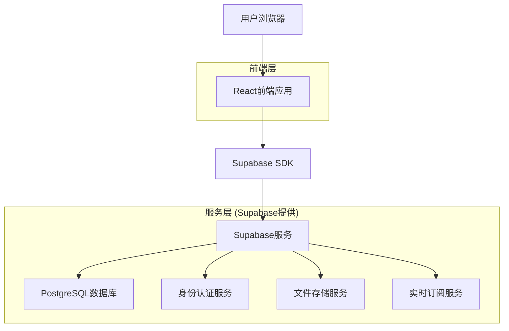
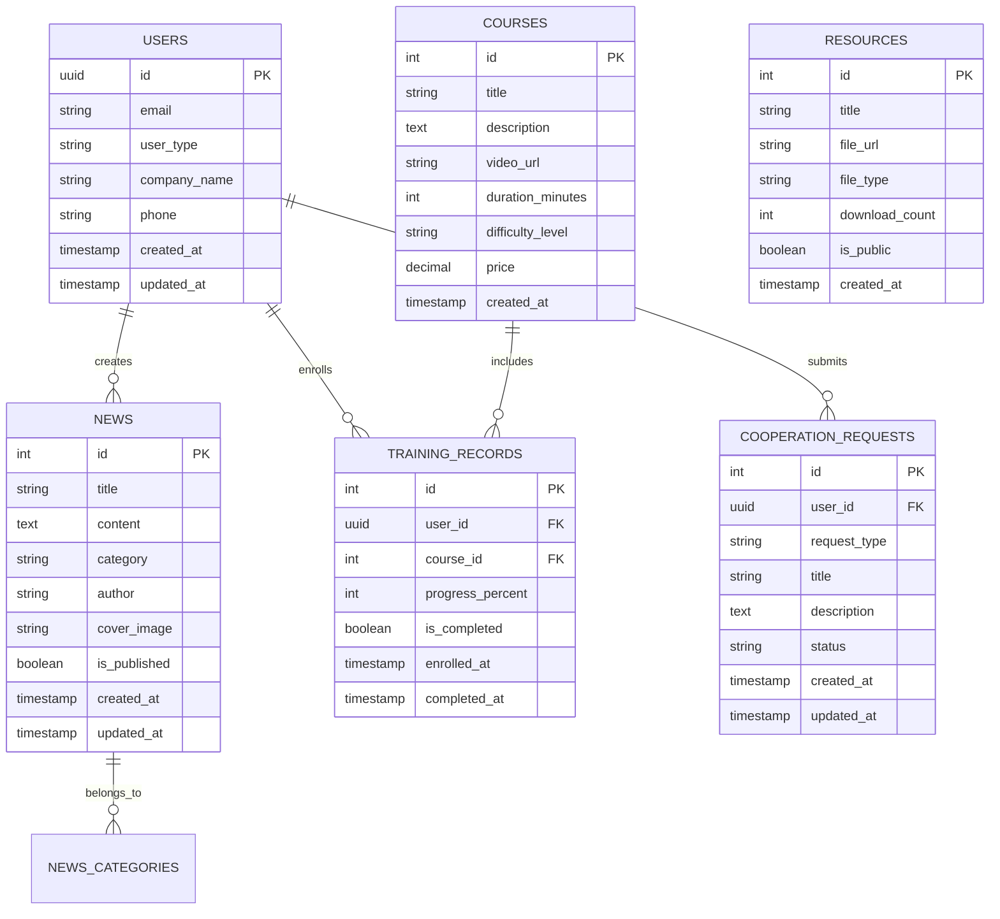

# 农业数字化转型促进中心网站技术架构文档

## 1. 架构设计



## 2. 技术描述

- **前端**: React@18 + TypeScript + Tailwind CSS@3 + Vite
- **后端**: Supabase (PostgreSQL + 认证 + 存储)
- **状态管理**: React Context + useState/useReducer
- **路由**: React Router@6
- **UI组件**: Headless UI + 自定义组件
- **图标**: Heroicons
- **部署**: Vercel (前端) + Supabase (后端服务)

## 3. 路由定义

| 路由 | 用途 |
|------|------|
| / | 首页，展示中心概况和核心服务 |
| /about | 中心介绍页面，包含组织架构和团队信息 |
| /services | 技术服务页面，展示解决方案和案例 |
| /training | 人才培养页面，课程和在线学习平台 |
| /cooperation | 产业对接页面，需求发布和项目匹配 |
| /news | 新闻资讯页面，行业动态和政策解读 |
| /news/:id | 新闻详情页面 |
| /resources | 资源下载页面，技术文档和工具 |
| /contact | 联系我们页面，联系方式和在线咨询 |
| /login | 用户登录页面 |
| /register | 用户注册页面 |
| /profile | 用户个人中心 |
| /admin | 管理后台（管理员专用） |

## 4. API定义

### 4.1 核心API

**用户认证相关**
```
POST /auth/v1/signup
```

请求参数:
| 参数名 | 参数类型 | 是否必需 | 描述 |
|--------|----------|----------|------|
| email | string | true | 用户邮箱 |
| password | string | true | 用户密码 |
| user_type | string | true | 用户类型 (individual/enterprise) |

响应:
| 参数名 | 参数类型 | 描述 |
|--------|----------|------|
| user | object | 用户信息对象 |
| session | object | 会话信息 |

**新闻管理相关**
```
GET /rest/v1/news
```

请求参数:
| 参数名 | 参数类型 | 是否必需 | 描述 |
|--------|----------|----------|------|
| category | string | false | 新闻分类筛选 |
| limit | number | false | 返回数量限制 |
| offset | number | false | 分页偏移量 |

响应:
```json
[
  {
    "id": 1,
    "title": "农业数字化转型新政策发布",
    "content": "详细内容...",
    "category": "policy",
    "created_at": "2024-01-15T10:00:00Z",
    "author": "管理员"
  }
]
```

## 5. 数据模型

### 5.1 数据模型定义



### 5.2 数据定义语言

**用户表 (users)**
```sql
-- 创建用户表
CREATE TABLE users (
    id UUID PRIMARY KEY DEFAULT gen_random_uuid(),
    email VARCHAR(255) UNIQUE NOT NULL,
    user_type VARCHAR(20) DEFAULT 'individual' CHECK (user_type IN ('individual', 'enterprise', 'admin')),
    company_name VARCHAR(255),
    phone VARCHAR(20),
    created_at TIMESTAMP WITH TIME ZONE DEFAULT NOW(),
    updated_at TIMESTAMP WITH TIME ZONE DEFAULT NOW()
);

-- 创建索引
CREATE INDEX idx_users_email ON users(email);
CREATE INDEX idx_users_user_type ON users(user_type);

-- 设置权限
GRANT SELECT ON users TO anon;
GRANT ALL PRIVILEGES ON users TO authenticated;
```

**新闻表 (news)**
```sql
-- 创建新闻表
CREATE TABLE news (
    id SERIAL PRIMARY KEY,
    title VARCHAR(255) NOT NULL,
    content TEXT NOT NULL,
    category VARCHAR(50) DEFAULT 'general' CHECK (category IN ('policy', 'technology', 'industry', 'activity', 'general')),
    author VARCHAR(100) NOT NULL,
    cover_image VARCHAR(500),
    is_published BOOLEAN DEFAULT false,
    created_at TIMESTAMP WITH TIME ZONE DEFAULT NOW(),
    updated_at TIMESTAMP WITH TIME ZONE DEFAULT NOW()
);

-- 创建索引
CREATE INDEX idx_news_category ON news(category);
CREATE INDEX idx_news_created_at ON news(created_at DESC);
CREATE INDEX idx_news_published ON news(is_published);

-- 设置权限
GRANT SELECT ON news TO anon;
GRANT ALL PRIVILEGES ON news TO authenticated;

-- 初始化数据
INSERT INTO news (title, content, category, author, is_published) VALUES
('农业数字化转型政策解读', '国家发布了新的农业数字化转型指导意见...', 'policy', '政策研究部', true),
('智慧农业技术发展趋势', '物联网、大数据、人工智能在农业领域的应用...', 'technology', '技术专家', true),
('数字农业产业发展报告', '2024年数字农业产业发展现状与前景分析...', 'industry', '产业分析师', true);
```

**课程表 (courses)**
```sql
-- 创建课程表
CREATE TABLE courses (
    id SERIAL PRIMARY KEY,
    title VARCHAR(255) NOT NULL,
    description TEXT,
    video_url VARCHAR(500),
    duration_minutes INTEGER DEFAULT 0,
    difficulty_level VARCHAR(20) DEFAULT 'beginner' CHECK (difficulty_level IN ('beginner', 'intermediate', 'advanced')),
    price DECIMAL(10,2) DEFAULT 0.00,
    created_at TIMESTAMP WITH TIME ZONE DEFAULT NOW()
);

-- 创建索引
CREATE INDEX idx_courses_difficulty ON courses(difficulty_level);
CREATE INDEX idx_courses_price ON courses(price);

-- 设置权限
GRANT SELECT ON courses TO anon;
GRANT ALL PRIVILEGES ON courses TO authenticated;

-- 初始化数据
INSERT INTO courses (title, description, duration_minutes, difficulty_level, price) VALUES
('农业物联网基础', '学习农业物联网的基本概念和应用场景', 120, 'beginner', 0.00),
('智慧农业数据分析', '掌握农业大数据分析方法和工具使用', 180, 'intermediate', 299.00),
('农业AI应用开发', '深入学习人工智能在农业领域的应用开发', 240, 'advanced', 599.00);
```

**培训记录表 (training_records)**
```sql
-- 创建培训记录表
CREATE TABLE training_records (
    id SERIAL PRIMARY KEY,
    user_id UUID REFERENCES users(id) ON DELETE CASCADE,
    course_id INTEGER REFERENCES courses(id) ON DELETE CASCADE,
    progress_percent INTEGER DEFAULT 0 CHECK (progress_percent >= 0 AND progress_percent <= 100),
    is_completed BOOLEAN DEFAULT false,
    enrolled_at TIMESTAMP WITH TIME ZONE DEFAULT NOW(),
    completed_at TIMESTAMP WITH TIME ZONE
);

-- 创建索引
CREATE INDEX idx_training_records_user_id ON training_records(user_id);
CREATE INDEX idx_training_records_course_id ON training_records(course_id);
CREATE INDEX idx_training_records_completed ON training_records(is_completed);

-- 设置权限
GRANT SELECT ON training_records TO anon;
GRANT ALL PRIVILEGES ON training_records TO authenticated;
```

**合作申请表 (cooperation_requests)**
```sql
-- 创建合作申请表
CREATE TABLE cooperation_requests (
    id SERIAL PRIMARY KEY,
    user_id UUID REFERENCES users(id) ON DELETE CASCADE,
    request_type VARCHAR(50) DEFAULT 'consultation' CHECK (request_type IN ('consultation', 'project', 'partnership', 'training')),
    title VARCHAR(255) NOT NULL,
    description TEXT NOT NULL,
    status VARCHAR(20) DEFAULT 'pending' CHECK (status IN ('pending', 'processing', 'completed', 'rejected')),
    created_at TIMESTAMP WITH TIME ZONE DEFAULT NOW(),
    updated_at TIMESTAMP WITH TIME ZONE DEFAULT NOW()
);

-- 创建索引
CREATE INDEX idx_cooperation_requests_user_id ON cooperation_requests(user_id);
CREATE INDEX idx_cooperation_requests_status ON cooperation_requests(status);
CREATE INDEX idx_cooperation_requests_type ON cooperation_requests(request_type);

-- 设置权限
GRANT SELECT ON cooperation_requests TO anon;
GRANT ALL PRIVILEGES ON cooperation_requests TO authenticated;
```

**资源表 (resources)**
```sql
-- 创建资源表
CREATE TABLE resources (
    id SERIAL PRIMARY KEY,
    title VARCHAR(255) NOT NULL,
    file_url VARCHAR(500) NOT NULL,
    file_type VARCHAR(50) NOT NULL,
    download_count INTEGER DEFAULT 0,
    is_public BOOLEAN DEFAULT true,
    created_at TIMESTAMP WITH TIME ZONE DEFAULT NOW()
);

-- 创建索引
CREATE INDEX idx_resources_file_type ON resources(file_type);
CREATE INDEX idx_resources_public ON resources(is_public);
CREATE INDEX idx_resources_download_count ON resources(download_count DESC);

-- 设置权限
GRANT SELECT ON resources TO anon;
GRANT ALL PRIVILEGES ON resources TO authenticated;

-- 初始化数据
INSERT INTO resources (title, file_url, file_type, is_public) VALUES
('农业数字化转型白皮书', '/files/digital-agriculture-whitepaper.pdf', 'PDF', true),
('智慧农业技术标准规范', '/files/smart-agriculture-standards.pdf', 'PDF', true),
('农业物联网开发工具包', '/files/iot-toolkit.zip', 'ZIP', false);
```