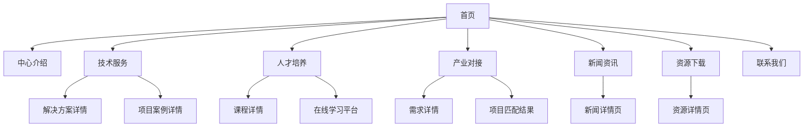

# 农业数字化转型促进中心网站产品需求文档

## 1. 产品概述

农业数字化转型促进中心官方网站是一个集展示、服务、交流于一体的综合性平台，致力于推动传统农业向智慧农业转型升级。
- 主要解决农业数字化技术推广、人才培养、产业对接等核心问题，服务于农业企业、科研院所、政府部门和农业从业者。
- 通过数字化手段促进农业现代化发展，打造农业数字化转型的权威信息平台和服务枢纽。

## 2. 核心功能

### 2.1 用户角色

| 角色 | 注册方式 | 核心权限 |
|------|----------|----------|
| 访客用户 | 无需注册 | 浏览公开信息、下载公开资料 |
| 注册用户 | 邮箱注册 | 参与在线培训、下载专业资料、提交合作申请 |
| 企业用户 | 企业认证注册 | 发布需求信息、参与项目对接、获取定制服务 |
| 管理员 | 内部分配 | 内容管理、用户管理、数据统计分析 |

### 2.2 功能模块

网站需求包含以下主要页面：
1. **首页**：品牌展示区、导航菜单、新闻动态、核心服务介绍
2. **中心介绍**：组织架构、发展历程、核心理念、团队展示
3. **技术服务**：数字化解决方案、技术咨询、项目案例展示
4. **人才培养**：培训课程、认证体系、在线学习平台
5. **产业对接**：需求发布、项目匹配、合作伙伴展示
6. **新闻资讯**：行业动态、政策解读、技术前沿、活动公告
7. **资源下载**：技术文档、研究报告、标准规范、工具软件
8. **联系我们**：联系方式、在线咨询、意见反馈、地理位置

### 2.3 页面详情

| 页面名称 | 模块名称 | 功能描述 |
|----------|----------|----------|
| 首页 | 品牌展示区 | 轮播图展示中心形象、重大成果和活动；包含中心logo、slogan和核心价值主张 |
| 首页 | 导航菜单 | 顶部导航栏包含所有主要页面入口；支持下拉菜单显示二级页面 |
| 首页 | 新闻动态 | 显示最新3-5条重要新闻；支持分类筛选和更多链接跳转 |
| 首页 | 核心服务 | 以卡片形式展示4大核心服务模块；包含图标、标题和简要描述 |
| 中心介绍 | 组织架构 | 展示中心组织结构图、各部门职能介绍；支持交互式组织架构图 |
| 中心介绍 | 团队展示 | 领导团队和专家团队介绍；包含照片、职务、专业领域和联系方式 |
| 技术服务 | 解决方案 | 分类展示数字化农业解决方案；包含方案介绍、技术特点、应用场景 |
| 技术服务 | 项目案例 | 成功案例展示；包含项目背景、实施过程、效果评估和客户反馈 |
| 人才培养 | 培训课程 | 课程分类展示、课程详情、报名入口；支持在线预约和课程评价 |
| 人才培养 | 在线学习 | 视频课程播放、学习进度跟踪、考试测评；支持学习记录和证书下载 |
| 产业对接 | 需求发布 | 企业需求信息发布和展示；支持需求分类、搜索和筛选功能 |
| 产业对接 | 项目匹配 | 智能匹配算法推荐合适项目；支持在线沟通和合作意向提交 |
| 新闻资讯 | 内容管理 | 新闻分类展示、详情页面、评论互动；支持标签筛选和搜索功能 |
| 资源下载 | 文档管理 | 分类展示各类资源文件；支持在线预览、下载统计和权限控制 |
| 联系我们 | 在线咨询 | 实时聊天功能、留言板、FAQ；支持多渠道联系方式展示 |

## 3. 核心流程

**访客用户流程：**
用户访问首页 → 浏览中心介绍了解背景 → 查看技术服务和案例 → 浏览新闻资讯获取行业信息 → 下载公开资源 → 通过联系页面获取更多信息

**注册用户流程：**
用户注册登录 → 完善个人信息 → 参与在线培训课程 → 下载专业资料 → 提交合作申请或技术咨询 → 跟踪服务进度

**企业用户流程：**
企业认证注册 → 发布数字化转型需求 → 浏览匹配的解决方案 → 联系技术专家 → 签署合作协议 → 项目实施跟踪

## 4. 用户界面设计

### 4.1 设计风格

- **主色调**：绿色系（#2E7D32 深绿、#4CAF50 主绿、#81C784 浅绿）体现农业和科技融合
- **辅助色**：蓝色系（#1976D2 科技蓝）和橙色系（#FF9800 活力橙）
- **按钮样式**：圆角矩形按钮，支持悬停效果和渐变色彩
- **字体**：中文使用思源黑体，英文使用Roboto，标题18-24px，正文14-16px
- **布局风格**：响应式卡片布局，顶部固定导航，左右对称设计
- **图标风格**：线性图标配合实心图标，统一使用Material Design图标库

### 4.2 页面设计概览

| 页面名称 | 模块名称 | UI元素 |
|----------|----------|--------|
| 首页 | 品牌展示区 | 全屏轮播图，白色文字叠加，渐变遮罩效果，自动播放3秒切换 |
| 首页 | 导航菜单 | 白色背景，绿色logo，黑色文字，悬停显示绿色下划线，固定顶部 |
| 首页 | 核心服务 | 4列网格布局，白色卡片，绿色图标，阴影效果，悬停放大1.05倍 |
| 技术服务 | 解决方案 | 左右交替布局，图文结合，绿色标题，灰色描述文字，CTA按钮 |
| 人才培养 | 课程列表 | 3列网格，课程封面图，进度条显示，绿色"立即学习"按钮 |
| 新闻资讯 | 文章列表 | 左侧缩略图，右侧标题和摘要，时间标签，分类标签不同颜色 |
| 联系我们 | 地图展示 | 嵌入式地图，右侧联系信息卡片，绿色联系按钮，表单输入框 |

### 4.3 响应式设计

网站采用移动优先的响应式设计，支持桌面端（1200px+）、平板端（768-1199px）和移动端（<768px）。移动端优化触摸交互，增大按钮点击区域，简化导航结构为汉堡菜单。